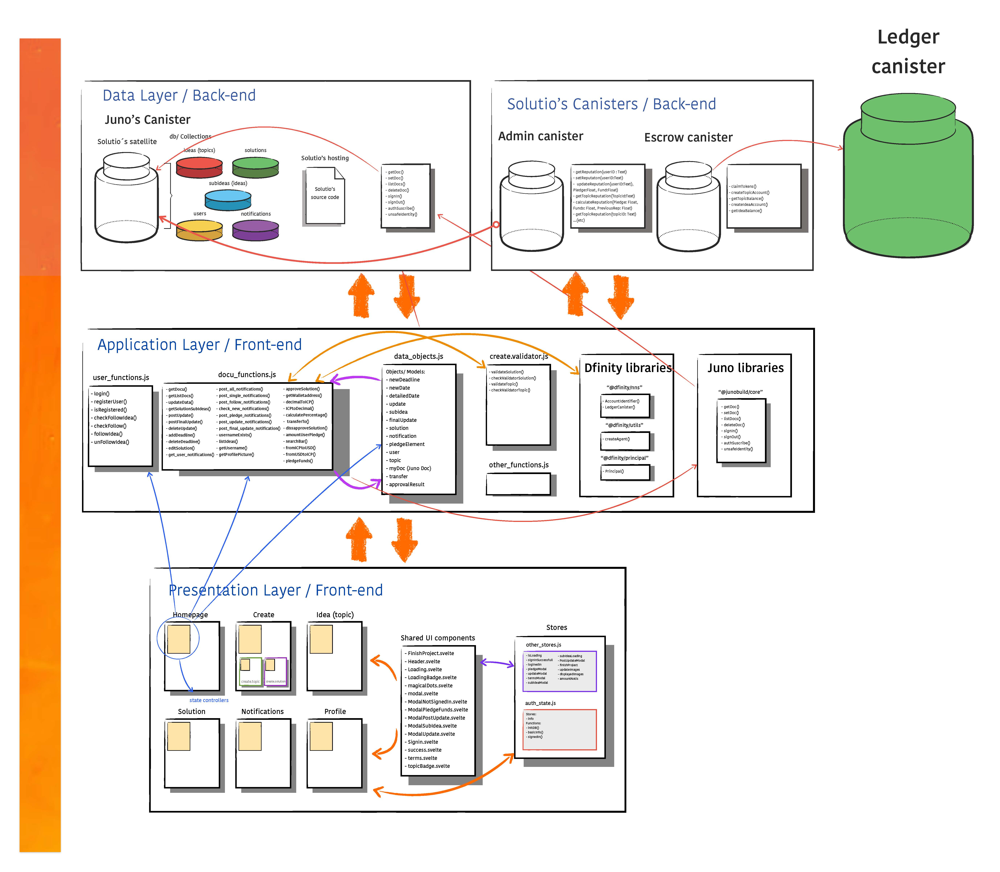

# Solutio back-end canisters overview
<p align="center">

</p>

[Solutio](https://xh6qb-uyaaa-aaaal-acuaq-cai.icp0.io/) is a decentralized application built on the [Internet Computer](https://internetcomputer.org/), enabling users to share innovative ideas, collaborate on developments, and pledge funding. It bridges the gap between idea generation and implementation, leveraging the power of the blockchain to bring solutions to life.

## Key functionalities of the backend

In addressing the complexities of Solutio's platform development, we've acknowledged the need for dedicated canister solutions that are specifically tailored to tackle various operational challenges. These canister solutions—namely the Admin Canister and the Escrow Canister—are architectural components designed to enhance the functionality, security, and efficiency of the Solutio infrastructure.

1. **Admin Canister**: Serves as a centralized controller for critical administrative tasks, ensuring sensitive data management, user reputation calculations, pledges management, and secure notifications.

2. **Escrow Canister**: Focuses on managing escrow processes, facilitating secure transactions, and providing detailed records of user fund allocations.

The front-end establish a framework utilizing [ICRC-2](https://github.com/dfinity/ICRC-1/tree/aa82e52aaa74cc7c5f6a141e30b708bf42ede1e3/standards/ICRC-2) capabilities for users to approve users transactions to the Escrow Canister. And this canister also uses ICRC-2 capabilities to transfer tokens.

## Key components / structure
This part of the project is structured completely into the backend-end components of the whole platform (excluding our juno satellite), with Motoko being the primary language used. The front-end section of the project is detailed [here](https://github.com/Bautista1999/solut/blob/main/README.md), and is hosted by [Juno](juno.build).

### Project's folder overview

```
solutio_admin
│
├── README.md
├── dfx.json
├── package-lock.json
├── package.json
│
├── src
│   ├── declarations
│   │   ├── solutio_admin_backend
│   │   │   └── [Candid and JavaScript Binding Files]
│   │   └── solutio_admin_frontend
│   │       └── [Candid and JavaScript Binding Files]
│   │
│   └── solutio_admin_backend
│      ├── juno.bridge.mo
│      ├── main.mo
│      └── types.mo
└── webpack.config.js
```

### Project's folder walkthrough
- `src/declarations`
contains the generated declarations for interacting with the canisters.
- `src/solutio_admin_backend`
Contains Motoko source code for the backend logic of Solutio. This contains:
  - `juno.bridge.mo`: A bridge module for interacting with the backend juno canister. This canister is the satellite of Solutio, where all of our database is located. Specifically, this files implements juno key functions to interact with the satellite. [Here](https://dashboard.internetcomputer.org/canister/svftd-daaaa-aaaal-adr3a-cai) you can see the icp dashboard of the canister. You can see the documentation of its functions on these links:
    1. [setJunoDoc](https://forum.solutio.one/-152/setjunodoc-documentation)(): function to set documents in Juno.  
    
    2. [setManyJunoDocs](https://forum.solutio.one/-153/setmanyjunodocs-documentation)(): set many documents in Juno.  
    
    3. [updateJunoDoc](https://forum.solutio.one/-160)(): function to update documents in Juno.  
    
    4. [updateManyJunoDocs](https://forum.solutio.one/-161/updatemanyjunodocs-documentation)(): update many documents in Juno.  
    
    5. [getJunoDoc](https://forum.solutio.one/-154/getjunodoc-documentation)(): function to get a document from juno. 
    
    6. [getManyJunoDocs](https://forum.solutio.one/-155/getmanyjunodocs-documentation)(): get many documents in Juno. 
      
    7. [listJunoDocs](https://forum.solutio.one/-156/listjunodocs-documentation)(): function to get a list of documents in Juno. 
    
    8. [deleteJunoDoc](https://forum.solutio.one/-158/deletejunodoc-documentation)(): delete docs in Juno. 
    
    9. [deleteManyJunoDocs](https://forum.solutio.one/-159/deletemanyjunodocs-documentation)(): function to delete docs in Juno.
  
  - `main.mo`: The main entry point of the backend canister. Here the public functions are located.
  - `types.mo`: Defines Motoko types used across the backend. It helps in maintaining a clean codebase by abstracting type definitions into a separate module.

## Solutio's ecosystem interaction overview


## Solutio's software architecture overview



## Getting Started

### Prerequisites

- Node.js and npm
- DFX

### Setup

1. Clone the repository and navigate into the project directory:

```bash
git clone [repository_url]
cd [project_name]
```
2. Install dependencies:

```bash
npm install
```

3. Start the DFX local network:

```bash
dfx start --clean
```
4. Deploy the canisters to the local network:

```bash
dfx deploy
```

## Contributing
Contributions are welcome! Please, include feature requests with your improvements [here](https://forum.solutio.one/top/feedback). 

## Links
- Developer: [Bautista Martinez](https://github.com/Bautista1999/solut/commits?author=Bautista1999)
- Project front-end: https://github.com/your_username/solutio
- Solutio's webpage: https://xh6qb-uyaaa-aaaal-acuaq-cai.icp0.io/
- Solutio's homepage: https://home.solutio.one/
- Juno: juno.build
